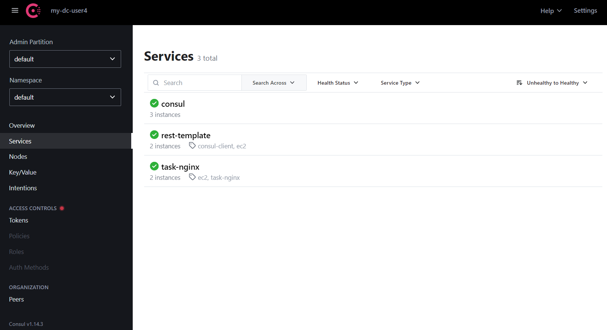
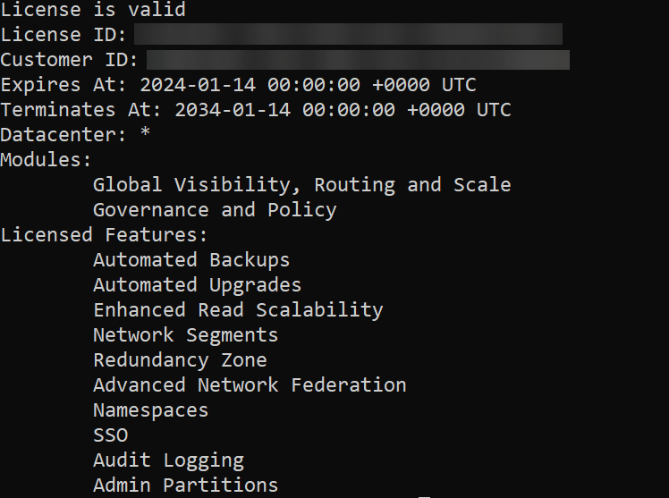
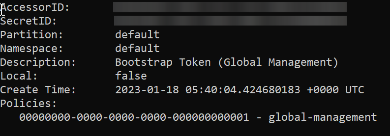

# HashiCorp_Consul
All about HashiCorp Consul

## Enterprise GUI


## Useful Commands
**Check membership**
```
consul members
```

check license validity 
```
consul license get
```


check services in consul server
```
consul catalog services
```

Enabling Consul ACL global-management token
```
consul acl bootstrap
```


## DNS routing using masquerading
- make sure iptables disabled
- install dnsmasq using **apt install dnsmasq**
- stop resolvd using **sudo systemctl systemd-resolved**
- add **nameserver 8.8.8.8** in **/etc/resolv.conf** for internet access
- add **server=/consul/127.0.0.1#8600** at the last line in /etc/dnsmasq.conf
